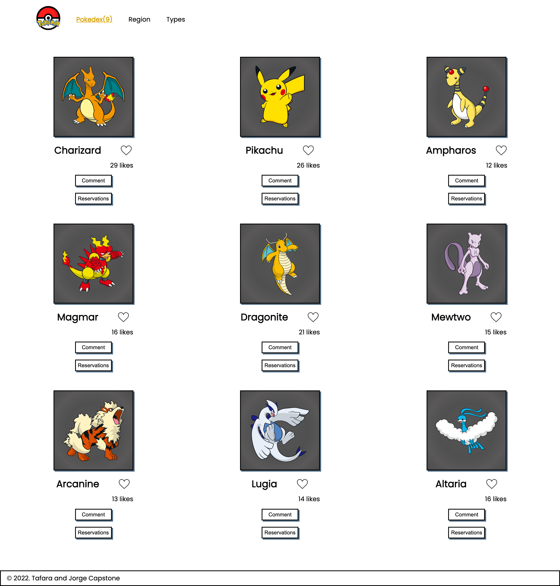
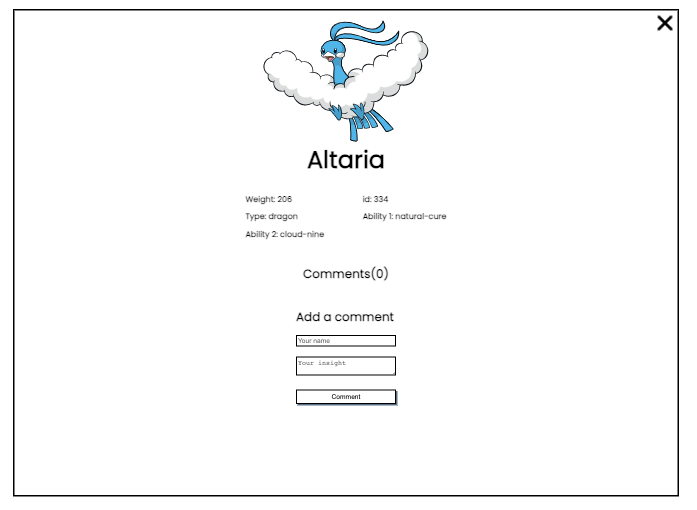

# Pokemon-profiles-capstone

> In this project We build a web application based on PokeAPI. The app has two interfaces a home page and a popup window. We are using HTML, CSS JavaScript, Webpack, Jest and APIs.

## Screenshot




## Built With

- HTML
- CSS
- JavaScript
- Webpackç
- Jest
- PokeAPI
- Involvement API

<!-- ## Live Demo
For a live demo of the Portfolio [click here](https://Alexr16.github.io/Pokemon-profiles-capstone/). -->

## Getting Started

To get a local copy of the project, follow these steps: 
1. Open the terminal and navigate to the folder where you would like to put these files.
2. Type the following commands into the terminal: 
 ```
 git clone https://github.com/Alexr16/Pokemon-profiles-capstone
 ```
 ```
 cd Pokemon-profiles-capstone
 ```
 
## Run project

```bash
$ npm install
$ npm run start # this will make webpack watching for your changes in code
```

### Open page in browser

```bash
$ open dist/index.html
```

## Author

👤 **George**

- GitHub: [@Alexr16](https://github.com/Alexr16)
- Twitter: [@ReveloJ](https://twitter.com/ReveloJ)
- LinkedIn: [Jorge Ríos](https://www.linkedin.com/in/jorge-r%C3%ADos-3b33ab22b)

👤 **Tafara Mafemba**

- GitHub: [@tafaramafemba](https://github.com/tafaramafemba)
- Twitter: [@the_real_you___](https://twitter.com/the_real_you___)
- LinkedIn: [Tafara Mafemba](https://www.linkedin.com/in/tafara-mafemba-4b82a0156/)

## 🤝 Contributing

Contributions, issues, and feature requests are welcome!

Feel free to check the [issues page](https://github.com/Alexr16/Pokemon-profiles-capstone/issues).

## Show your support

Give a ⭐️ if you like this project!

## Acknowledgments

- Thanks to my peers who are always there to offer support. 

## 📝 License

This project is [MIT](./LICENSE) licensed.
